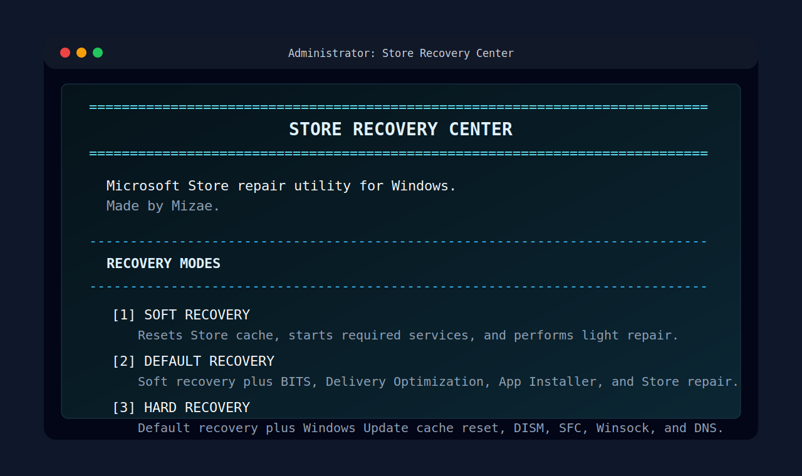
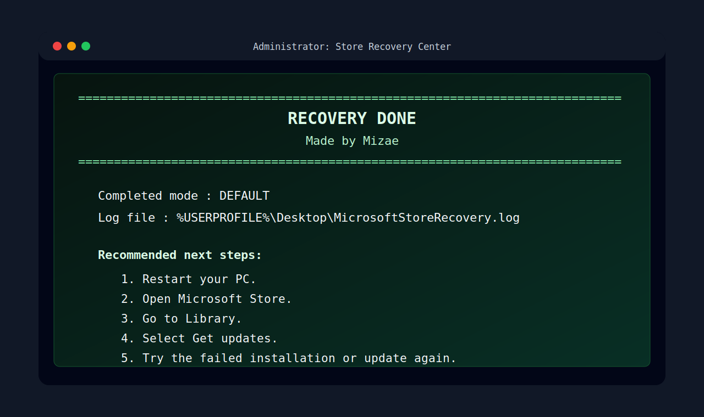

<div align="center">

<h1>MSStore Repair</h1>

<p>
  <strong>A focused Windows recovery utility for repairing Microsoft Store, App Installer, BITS, Delivery Optimization, and Store-related update problems.</strong>
</p>

<p>
  
  
  
</p>

<p>
  <a href="#overview">Overview</a>
  <span>&nbsp;|&nbsp;</span>
  <a href="#screenshots">Screenshots</a>
  <span>&nbsp;|&nbsp;</span>
  <a href="#what-it-fixes">What It Fixes</a>
  <span>&nbsp;|&nbsp;</span>
  <a href="#usage">Usage</a>
  <span>&nbsp;|&nbsp;</span>
  <a href="#recovery-modes">Recovery Modes</a>
</p>

</div>

---

## Overview

**MSStore Repair** is a Windows batch-based repair utility designed to recover Microsoft Store functionality when the Store, app updates, or app installations become stuck, broken, or unreliable.

It provides a guided terminal interface with three repair levels:

- **Soft Recovery** for quick cache and Store service repair.
- **Default Recovery** for common Store, BITS, Delivery Optimization, App Installer, and package registration issues.
- **Hard Recovery** for deeper Windows Update backend, system file, and network stack repair.

The project is intentionally simple: the main utility is a single file, [`recovery.bat`](./recovery.bat), built to be easy to inspect, easy to run, and easy to share.

MSStore Repair is useful when the Microsoft Store appears installed but behaves incorrectly, downloads never progress, app updates remain pending, or Windows Store components need to be re-registered.

---

## Screenshots

<p align="center">
  
  
</p>

---

## What It Fixes

MSStore Repair is intended to help with Store-related problems such as:

- Microsoft Store download stuck at **1%**.
- Microsoft Store stuck on **Pending**, **Downloading**, **Starting download**, or **Acquiring license**.
- Microsoft Store does not open correctly.
- Microsoft Store opens but app installation or updates fail.
- Store app updates do not progress from the Library page.
- App Installer-related problems affecting `.appx`, `.msix`, or Microsoft Store package handling.
- Broken or stale Microsoft Store cache.
- Broken Store package registration.
- BITS queue problems that affect app downloads.
- Delivery Optimization cache problems.
- Windows Update backend issues that can affect Microsoft Store downloads.
- DNS or Winsock issues that may prevent Store services from communicating correctly.
- Corrupted system files that can indirectly affect the Microsoft Store.

This tool is not a replacement for Windows reinstall or official Microsoft support, but it covers many common repair paths that are usually performed manually.

---

## How It Works

MSStore Repair performs a staged recovery process depending on the selected mode.

At a high level, it can:

- Require Administrator privileges before making system changes.
- Attempt to create a Windows restore point.
- Close active Microsoft Store processes.
- Start and configure required Windows services.
- Reset the Microsoft Store cache with `wsreset.exe`.
- Remove local Microsoft Store cache directories.
- Reset BITS jobs.
- Clear Delivery Optimization cache.
- Reset parts of the Windows Update download backend.
- Re-register Microsoft Store related AppX packages.
- Run DISM health restoration.
- Run System File Checker.
- Reset DNS and Windows network stack settings.
- Open Microsoft Store after recovery.
- Write a repair log to the Desktop.

The generated log is saved here:

```text
%USERPROFILE%\Desktop\MicrosoftStoreRecovery.log
```

---

## Recovery Modes

<table>
  <thead>
    <tr>
      <th>Mode</th>
      <th>Best For</th>
      <th>What It Does</th>
      <th>Estimated Time</th>
    </tr>
  </thead>
  <tbody>
    <tr>
      <td><strong>Soft Recovery</strong></td>
      <td>Small Store glitches, cache problems, Store not opening correctly.</td>
      <td>Starts required services, resets Store cache, cleans user Store cache, and re-registers Store-related apps.</td>
      <td>Fast</td>
    </tr>
    <tr>
      <td><strong>Default Recovery</strong></td>
      <td>Downloads stuck at 1%, pending updates, App Installer issues, Store repair after failed updates.</td>
      <td>Includes Soft Recovery, then resets BITS, Delivery Optimization, download queues, and related Store delivery components.</td>
      <td>Moderate</td>
    </tr>
    <tr>
      <td><strong>Hard Recovery</strong></td>
      <td>Persistent Store failures, broken Windows Update backend, system corruption symptoms, repeated Store install failures.</td>
      <td>Includes Default Recovery, then resets Windows Update cache areas, resets DNS/Winsock/IP stack, runs DISM RestoreHealth, and runs SFC.</td>
      <td>Long</td>
    </tr>
  </tbody>
</table>

Recommended order:

```text
Soft Recovery -> Default Recovery -> Hard Recovery
```

Start with the lightest repair mode. Move to the next mode only if the issue is not fixed.

---

## Usage

### 1. Download the script

Download or clone this repository, then locate:

```text
recovery.bat
```

If you downloaded the repository as a ZIP file, extract it first.

### 2. Run as Administrator

Right-click `recovery.bat` and select:

```text
Run as administrator
```

Administrator access is required because the tool modifies Windows services, Microsoft Store registration, Windows Update cache, and network settings.

### 3. Choose a recovery mode

When the menu appears, select one of the available recovery modes:

```text
[1] Soft Recovery
[2] Default Recovery
[3] Hard Recovery
[4] Exit
```

For most users, the recommended starting point is:

```text
2 - Default Recovery
```

Use **Soft Recovery** first if the issue is minor. Use **Hard Recovery** only when the problem continues after Soft or Default mode.

### 4. Wait for the process to finish

Do not close the window while the repair is running.

Hard Recovery can take a long time because it may run:

```text
DISM.exe /Online /Cleanup-Image /RestoreHealth
sfc.exe /scannow
```

These commands can appear slow or paused for several minutes. That is normal.

### 5. Restart your PC

After the recovery finishes, restart Windows.

Then open Microsoft Store and go to:

```text
Library -> Get updates
```

After that, try the failed installation or update again.

---

## Suggested Repair Flow

Use this flow if you are unsure which mode to choose:

<table>
  <thead>
    <tr>
      <th>Problem</th>
      <th>Recommended First Mode</th>
      <th>If Not Fixed</th>
    </tr>
  </thead>
  <tbody>
    <tr>
      <td>Microsoft Store opens slowly or behaves strangely.</td>
      <td>Soft Recovery</td>
      <td>Run Default Recovery.</td>
    </tr>
    <tr>
      <td>Downloads stuck at 1%.</td>
      <td>Default Recovery</td>
      <td>Restart, then run Hard Recovery.</td>
    </tr>
    <tr>
      <td>Updates stuck on Pending or Downloading.</td>
      <td>Default Recovery</td>
      <td>Run Hard Recovery.</td>
    </tr>
    <tr>
      <td>Store does not launch.</td>
      <td>Soft Recovery</td>
      <td>Run Default Recovery.</td>
    </tr>
    <tr>
      <td>Repeated install failures after multiple attempts.</td>
      <td>Default Recovery</td>
      <td>Run Hard Recovery.</td>
    </tr>
    <tr>
      <td>Windows Update and Microsoft Store are both broken.</td>
      <td>Hard Recovery</td>
      <td>Check the log and restart Windows.</td>
    </tr>
  </tbody>
</table>

---

## Requirements

- Windows 10 or Windows 11.
- Administrator access.
- Microsoft Store installed on the system.
- PowerShell available.
- Internet connection for Microsoft Store downloads and repairs that need online Windows component sources.

For DISM repair in Hard Recovery, Windows may need access to Windows Update or a valid component source.

---

## What Gets Changed

Depending on the selected mode, MSStore Repair may interact with the following Windows components:

| Component | Purpose |
| --- | --- |
| Microsoft Store cache | Removes stale Store cache files that may block downloads or updates. |
| AppX package registration | Re-registers Store-related package manifests. |
| BITS | Resets transfer jobs used by background downloads. |
| Delivery Optimization | Clears cached delivery data used by Store and Windows downloads. |
| Windows Update services | Restarts and repairs services related to Store delivery. |
| SoftwareDistribution | Clears selected Windows Update download/log cache areas in Hard Recovery. |
| Catroot2 | Renames the cryptographic catalog cache in Hard Recovery. |
| DNS cache | Flushes DNS resolver cache in Hard Recovery. |
| Winsock and IP stack | Resets network stack settings in Hard Recovery. |
| DISM and SFC | Repairs Windows image and system files in Hard Recovery. |

---

## Log File

Every run writes a log file to the Desktop:

```text
MicrosoftStoreRecovery.log
```

The log includes:

- Selected recovery mode.
- Start and finish time.
- Service repair output.
- PowerShell AppX registration output.
- DISM and SFC output when Hard Recovery is used.
- Service verification results.

If the Store is still broken after running MSStore Repair, check this log first.

---

## Safety Notes

MSStore Repair performs system-level repair actions. Read these notes before running it:

- Run it only from a trusted copy of this repository.
- Review [`recovery.bat`](./recovery.bat) before running it.
- Close Microsoft Store before starting the repair.
- Save open work before using Hard Recovery.
- Restart the PC after recovery.
- A restore point is attempted, but Windows may skip restore point creation if System Protection is disabled or restricted.
- Hard Recovery resets network stack settings, which may require a restart before everything behaves normally.

The script is provided as-is, without warranty.

---

## Limitations

MSStore Repair cannot guarantee a fix for every Microsoft Store issue.

It may not fix problems caused by:

- Microsoft account restrictions.
- Region, payment, or licensing issues.
- Microsoft Store service outages.
- Corporate, school, or group policy restrictions.
- Missing Microsoft Store packages that require a separate reinstall source.
- Severely damaged Windows installations.
- Third-party security software blocking Store traffic.
- Network firewalls, DNS filtering, or proxy rules outside Windows.

If the Store is still broken after Hard Recovery, check the log file and verify Windows Update, Microsoft account sign-in, system date/time, region settings, and network restrictions.

---

## File Structure

```text
MSStore Repair
├── recovery.bat
├── README.md
└── assets
    └── screenshots
        ├── msstore-repair-menu.svg
        └── msstore-repair-complete.svg
```

---

## Project Status

This project is lightweight and script-based. It is designed for practical Store recovery rather than a full installer or GUI application.

Future improvements may include:

- Optional dry-run mode.
- More detailed error-code guidance.
- Separate PowerShell edition.
- Automatic log summary.
- Safer package existence checks before repair actions.

---

## Disclaimer

MSStore Repair is an independent utility and is not affiliated with Microsoft.

Microsoft Store, Windows, App Installer, BITS, Delivery Optimization, DISM, and SFC are Microsoft technologies and trademarks of their respective owner.

Use this tool at your own risk. Always review scripts before running them with Administrator privileges.

---

<div align="center">

<strong>MSStore Repair</strong>

<br>

Professional Microsoft Store recovery for stuck downloads, broken updates, package registration issues, and Store delivery problems.

</div>
